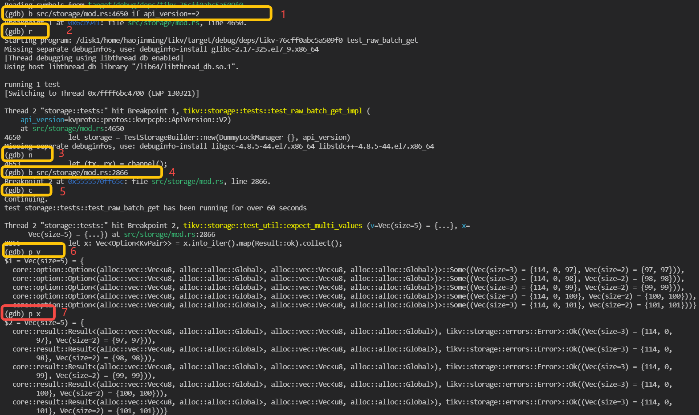
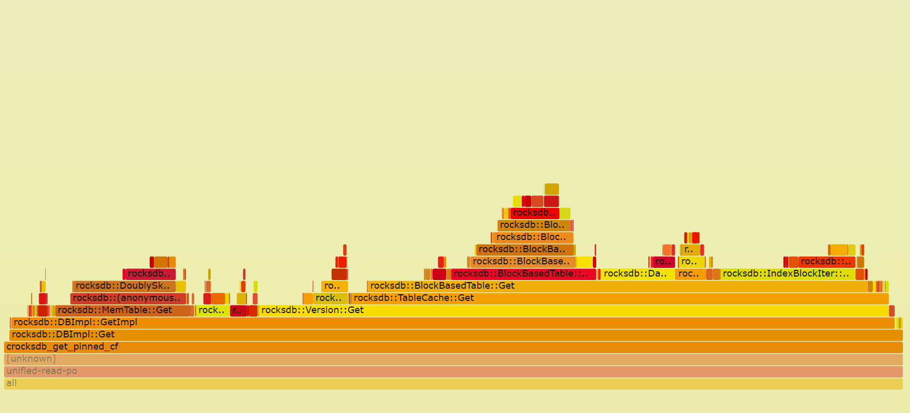

# Debug and Profile

In previous chapter, we introduce how to build TiKV from source, and in this chapter, we will focus on how to debug and profile TiKV from the view of a developer.

## Prerequisites

* rust-gdb or rust-lldb  
[GDB](https://www.sourceware.org/gdb) and [LLDB](https://lldb.llvm.org/) are commonly used for debugging a program.  
    * `rust-gdb` and `rust-lldb` are both installed with `rustup` together, however, they depend on `gdb` and `lldb`, which are need be installed by yourself. Here is the installation of gdb/lldb.
    ```bash
    Ubuntu: sudo apt-get install gdb/lldb
    CentOS: sudo yum install gdb/lldb
    ```
    * `gdb` and `lldb` can also be used to debug rust program.
    * Basically, `rust-gdb` is a wrapper that loads external Python pretty-printing scripts into GDB. This is useful (and somewhat necessary) when debugging more complex Rust programs because it significantly improves the display of Rust data types. `rust-lldb` is similar. So `rust-gdb` and `rust-lldb` are recommended.
    * About how to choose between `rust-gdb` and `rust-lldb`, it depends on the platform you are using and the familiarity of these tools. If you are new hand on the debugging tools, `rust-lldb` is recommended on MacOS and `rust-gdb` is recommended on Linux, like Ubuntu and CentOS. 
* perf  
[Perf](https://perf.wiki.kernel.org/index.php/Main_Page) is common Linux profiler. It's powerful: it can instrument CPU performance counters, tracepoints, kprobes, and uprobes (dynamic tracing). It can be installed as following:
```bash
Ubuntu: sudo apt-get install linux-tools
CentOS: sudo yum install perf
```

*For simplicity, we will introduce the debugging with rust-gdb, audience can also use rust-lldb.*

## Debug TiKV with rust-gdb

### Debug a unit test binary in TiKV

1. Build the unit test binary, for example we want to debug the test case: [test_raw_get_key_ttl](https://github.com/tikv/tikv/blob/a7d1595f5486616be34e0cf2bbf372edb5f0e85a/src/storage/mod.rs#L5352-L5356)

Firstly, we can get the binary file with cargo command, like: 
```bash
cargo test -p tikv test_raw_get_key_ttl
```
A binary file located in `target/debug/deps/tikv-some-hash` will be produced.

2. Debug the binary with rust-gdb:

```bash
rust-gdb --args target/debug/deps/tikv-4a32c89a00a366cb test_raw_get_key_ttl
```
3. Now the standard gdb interface is shown. We can debug the unit test with gdb command. Here are some simple commands.

* r(run) to start the program.
* b(break) file_name:line_number to set a breakpoint.
* p(print) args to print args.
* ls to show the surrounding codes of breakpoint.
* s(step) to step in the function.
* n(next) to step over current line.
* c(continue) to continue the program.
* watch to set a data watch breakpoint.

An example to deug an unit test named `test_raw_batch_get` is as following:
* build `tikv` unit test binary with `cargo test -p tikv test_raw_batch_get` and binary is located in `target/debug/deps/tikv-<somehash>`
* launch the binary with rust-gdb
```
rust-gdb --args target/debug/deps/tikv-<somehash> test_raw_batch_get
```
* debug 



As the marks shown in above picture, Firstly, a breakpoint is set in line `4650` of file `src/storage/mod.rs` and set condition that `api_version == 2`, which means program only pause when it hit here and the variable `api_version` is equals to 2. Then `run` is executed and the program start to run. The following steps are some examples to use gdb commands to execute the `step over` and `print`.

### Debug TiKV cluster with specified tikv-server binary

1. Build tikv-server binary with the guide in [previous chapter](./build-tikv-from-source.md).
2. The binary files are in \${TIKV_SOURCE_CODE}/target/debug/, debug binary is recommended as it keep much useful debug info, such as codes, lines, local variables.
3. TiUP is recommended to deploy a TiKV cluster. It's easy to deploy a local TiKV cluster with tiup playground. Please refer [Get start in 5 minutes](https://tikv.org/docs/5.1/concepts/tikv-in-5-minutes/#set-up-a-local-tikv-cluster-with-the-default-options). With TiUP, we can also specify the tikv-server binary file during deploy. The following is an example:

```bash
TIKV_BIN=~/tikv/target/release/tikv-server

tiup playground v5.0.4 --mode tikv-slim 
  --kv 3 --kv.binpath ${TIKV_BIN} --kv.config ./tikv_rawkv.toml
```

4. Now we get one TiKV cluster with three TiKV virtual nodes and one pd node. we can use rust-gdb to attach the tikv-server process.

```bash
rust-gdb attach ${PID}
```

pid of tikv-server can be obtained with the following command:

```bash
ps -aux|grep tikv-server
```
Now the standard GDB interface is shown, we can use rust-gdb as same an gdb. 

## Profiling TiKV
When we want to find the cpu bottleneck of one program, we can use [perf Linux profiler](https://www.brendangregg.com/perf.html) to find the events. It can also be used for profiling TiKV.  

Here is one example:

```bash
perf record -g -p `pidof tikv-server`

perf report
```

A profile file is generated and we can see the CPU usage during perf recording.

Another example is generating the flame graph with perf and [FlameGraph](http://www.brendangregg.com/flamegraphs.html) tools. 
1. Firstly, download the FlameGraph code.
```
git clone https://github.com/brendangregg/FlameGraph.git
```
2. Recording performance data with `perf`
```
perf record -g -p `pidof tikv-server`
```
3. Parse the perf data with script.
```
perf script -i perf.data &> perf.unfold
```
4. generate the flame graph
```
./stackcollapse-perf.pl perf.unfold &> perf.folded

./flamegraph.pl perf.folded > perf.svg
```
5. We can open the `svg` file with `chrome` or other browsers. With the flame graph, we can see the performance data more intuitively.

